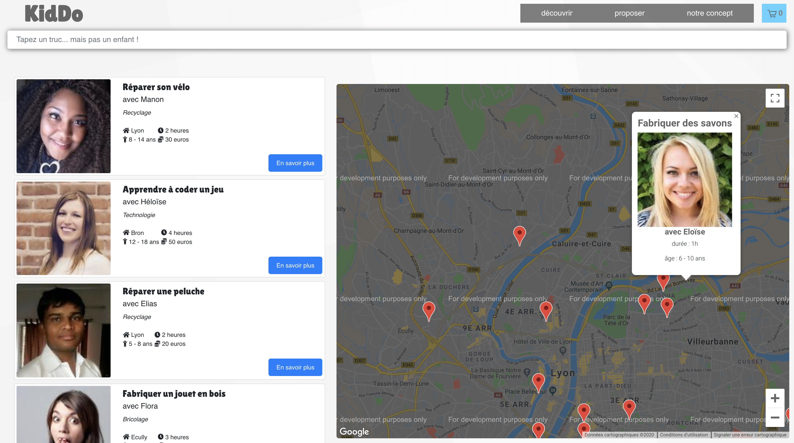
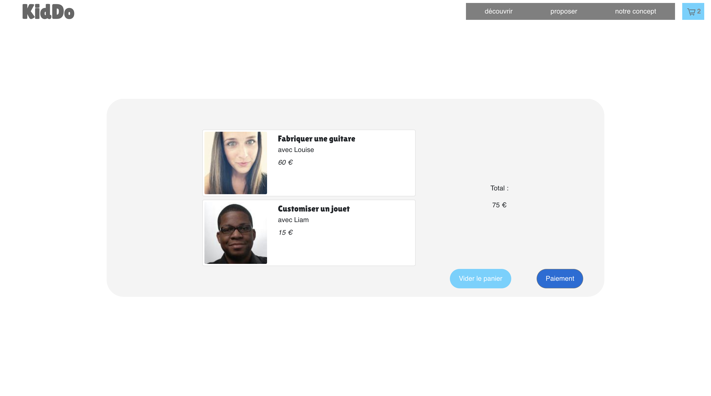
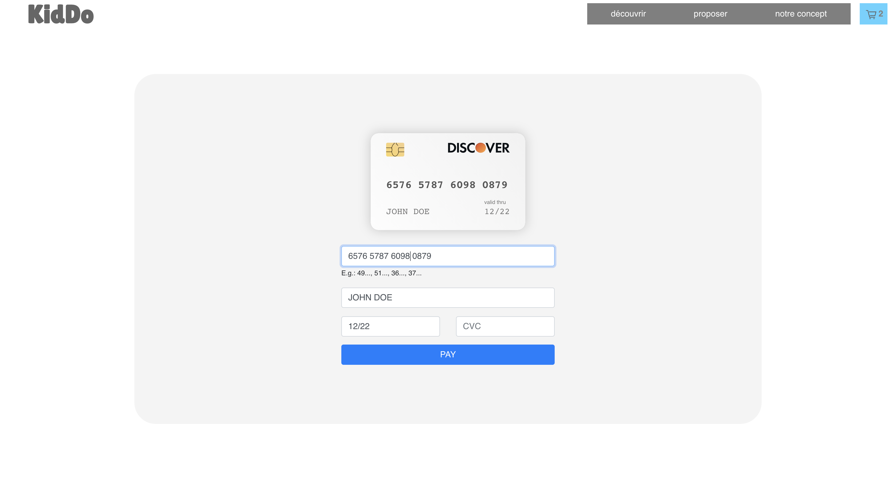

  

<h1 align="center">KidDo</h1>

<h2 align="center">Hackathon de 48h - REACT</h2>

Réalisation d'une application web. Le principe est de permettre aux parents d'offrir la possibilité à leurs enfants de fabriquer, ou réparer eux-mêmes leurs jouets à partir de produits recyclés, afin de proposer une alternative vertueuse et responsable à la surconsommation et à la fabrication de jouets en plastiques venant des quatres coins du globe, en faisant appel aux savoir-faire à proximité de chez eux.

Projet mené en méthodologie AGILE, avec :

- utilisation de Router

- une page de recherche, avec champs de recherche permettant de filtrer les résultats

- affichage d'une map (google maps) avec les points d’intérêts en fonction du résulat de la recherche

- possibilité de créer une nouvelle activité pour la faire apparaître dans la liste

 

  <kbd></kbd>
  <kbd></kbd>

 

- possibilité de selectionner une ou plusieurs activités afin de les mettre dans le panier

- une page panier permettant le paiement

 

  <kbd></kbd>
  <kbd></kbd>

 

<h3 align="center">
  Demo Live : https://hackathon-noel.netlify.com/#/
</h3>
 

This project was bootstrapped with [Create React App](https://github.com/facebook/create-react-app).

