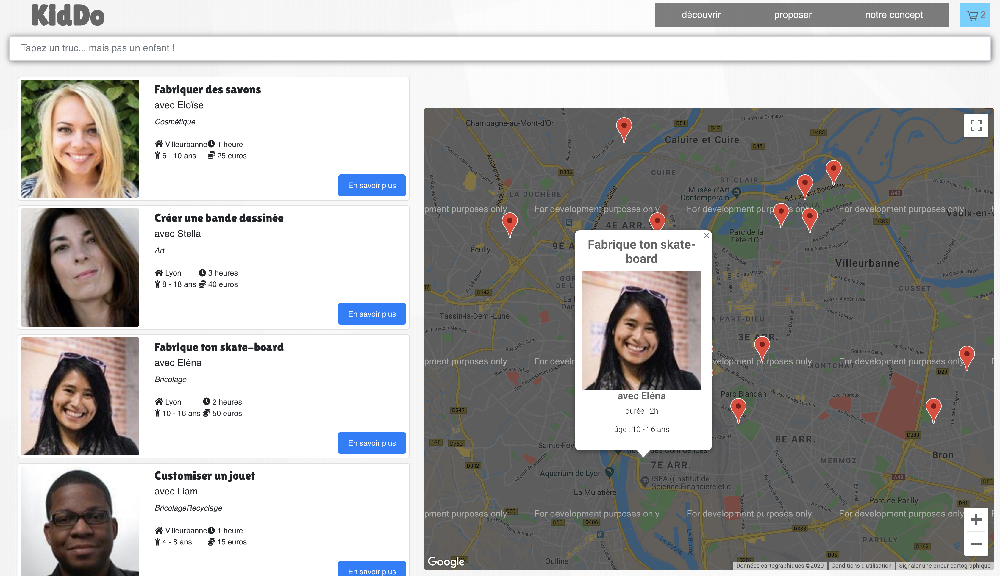

  

<h1 align="center">KidDo</h1>

## Hackathon de 48h - REACT - AGILE

Réalisation d'une application web. Le principe est de permettre aux parents d'offrir la possibilité à leurs enfants de fabriquer, ou réparer eux-mêmes leurs jouets à partir de produits recyclés, afin de proposer une alternative vertueuse et responsable à la surconsommation et à la fabrication de jouets en plastiques venant des quatres coins du globe.

Projet mené en méthodologie AGILE, avec :

- utilisation de Router
- une page de recherche, avec champs de recherche permettant de filtrer les résultats 
- affichage d'une map (google maps) avec les points d’intérêts en fonction du résulat de la recherche
 

  
  

 
- possibilité de créer une nouvelle activité pour la faire apparaître dans la liste
- possibilité de selectionner une ou plusieurs activités afin de les mettre dans le panier
- une page panier permettant le paiement 
 

  
  

 

  Demo Live : https://hackathon-noel.netlify.com/#/

 
 
This project was bootstrapped with [Create React App](https://github.com/facebook/create-react-app).

